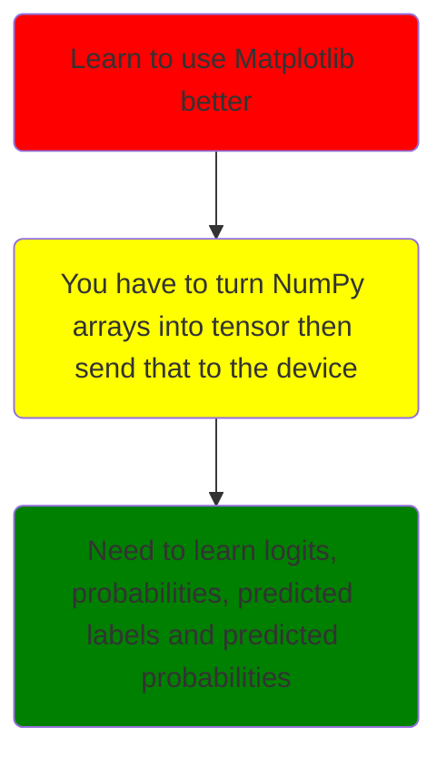

```mermaid
    flowchart TD
    
    id(Learn to use Matplotlib better)

    style id fill:red

    id2(You have to turn NumPy arrays into tensor then send that to the device)

    style id2 fill:yellow

    id-->id2

    id3(Need to learn logits, probabilities, predicted labels and predicted probabilities)

    style id3 fill:green

    id2-->id3 

```