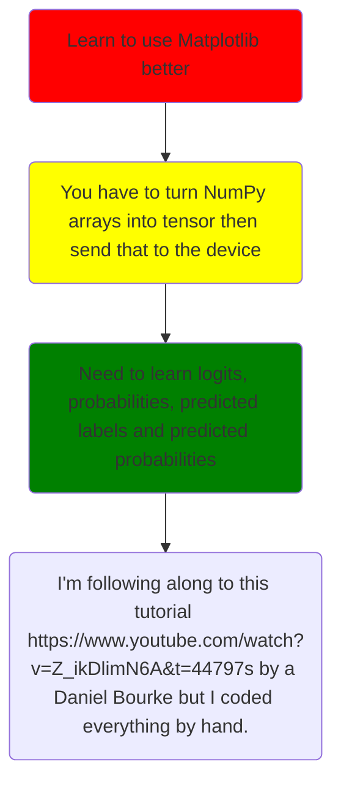

```mermaid
    flowchart TD
    
    id(Learn to use Matplotlib better)

    style id fill:red

    id2(You have to turn NumPy arrays into tensor then send that to the device)

    style id2 fill:yellow

    id-->id2

    id3(Need to learn logits, probabilities, predicted labels and predicted probabilities)

    style id3 fill:green

    id2-->id3 

    id4(I'm following along to this tutorial https://www.youtube.com/watch?v=Z_ikDlimN6A&t=44797s by a Daniel Bourke but I coded everything by hand.)

    id3-->id4

```